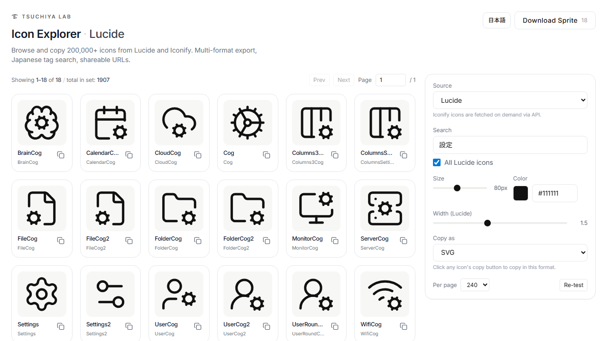

# Icon Explorer

A free, fast icon browser for developers and designers.
Search [Lucide](https://lucide.dev) and 150+ [Iconify](https://iconify.design) icon sets,
customize size, color, and stroke, copy SVG with one click, and export sprites.

**[Live demo →](https://icons.tsuchiyalab.com)**

<!-- Add screenshot at .github/preview.png and uncomment the line below -->
<!--  -->

## Features

- **200,000+ icons** across Lucide and Iconify collections
- **Customizable** size, color, and stroke width
- **One-click SVG copy** with current style applied
- **SVG sprite export** for static sites
- **Browse and switch** Iconify collections from the in-app sets browser
- **License filter** for Iconify sets (MIT, Apache 2.0, CC0, etc.)
- **Fast pagination** and lazy preview rendering for large sets
- **Single-file HTML** — no build, no install, no framework

## Quick start

### Use the hosted version

Visit **[icons.tsuchiyalab.com](https://icons.tsuchiyalab.com)** — no signup, no tracking, just icons.

### Run locally

```bash
git clone https://github.com/tsuchiyalab/icons.git
cd icons

# any static server works:
python3 -m http.server 8000 --directory public
# then open http://localhost:8000
```

No build step. The HTML file pulls Lucide and Iconify from CDN.

### Deploy your own (Cloudflare Workers)

The repo ships with Cloudflare Workers Static Assets configuration:

```bash
npm install
npx wrangler deploy
```

## How it works

- **Lucide icons** are loaded from the official UMD bundle and rendered as inline SVG. Stroke width applies live.
- **Iconify icons** use the official Web Component (`<iconify-icon>`) for on-demand rendering, plus the [Iconify API](https://iconify.design/docs/api/) for collection metadata. Color applies via `currentColor` substitution; stroke width is not applicable to most Iconify sets (they are filled-style).
- All data is fetched client-side. No server, no database, no telemetry.

## Why another icon browser?

Iconify and Lucide both have excellent official browsers. This tool is a thin alternative with a few opinionated choices:

- Right sidebar layout — controls always reachable, grid stays wide
- Page-based navigation for very large sets (Material, Phosphor, etc.)
- Built-in sprite export for static sites
- Single HTML file, easy to fork and customize for your team

## Tech

- Vanilla JavaScript (no framework, no bundler)
- [Tailwind CSS](https://tailwindcss.com) via CDN
- [Lucide](https://lucide.dev) UMD bundle
- [Iconify](https://iconify.design) Web Component + HTTP API

## License

MIT — see [LICENSE](LICENSE).

Icons themselves keep their original licenses:

- **Lucide** is MIT-licensed
- **Iconify icon sets** retain their respective upstream licenses (MIT, Apache 2.0, CC0, ISC, OFL, etc.). Use the in-app license filter to limit to specific licenses, and **always verify the original license at the source** before commercial use.

## Contributing

Issues and pull requests welcome. This is a single-file project — keep it simple.

## Built by

[**Tsuchiya Lab**](https://tsuchiyalab.com) — research and product studio.
